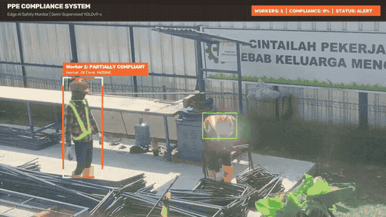
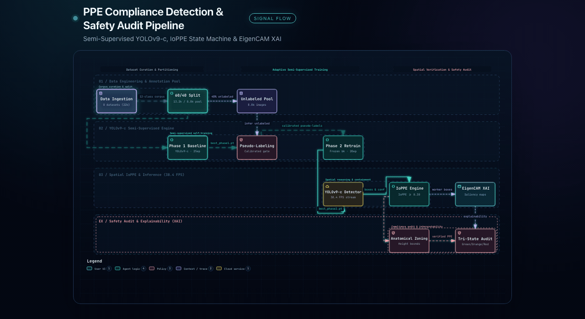

# Real-Time PPE Compliance Detection via Semi-Supervised YOLOv9-c

[](https://www.python.org/)
[-00FFFF.svg)](https://github.com/ultralytics/ultralytics)
[]()
[](docs/Manuscript_PPEcompliance_4.pdf)

An end-to-end computer vision and safety compliance pipeline for industrial and construction environments. This project reduces manual annotation overhead by **~40%** through **adaptive semi-supervised self-training** on YOLOv9-c, paired with a custom **Intersection over PPE Area (IoPPE)** spatial state machine running at **38.4 FPS**.

Developed by Group 4, Department of Informatics, Multimedia Nusantara University (UMN).

---

## Demo & Architecture

| Live Detection Demo | System Workflow & Architecture |
| :---: | :---: |
|  |  |

---

## Key Highlights

1. **Semi-Supervised Learning (SSL)**:
   * Trained on a merged **22,033-image corpus across 12 standardized PPE classes** (curated from 8 public datasets).
   * **60% labeled baseline / 40% unlabelled pool** with class-adaptive pseudo-labeling.
   * **Improved all 4 global metrics** over the supervised baseline: **0.8368 mAP@0.5** (+0.0060), **0.5981 mAP@0.5:0.95** (+0.0132), **0.8649 Precision**, and **0.8122 Recall**.
2. **IoPPE Spatial State Machine**:
   * Standard Intersection-over-Union (IoU) fails when calculating containment between person bounding boxes and small PPE items (helmets, masks, glasses).
   * We implement **Intersection over PPE Area (IoPPE)** with anatomical height zoning and bipartite matching:
     $$\text{IoPPE} = \frac{\text{Area}(\text{Box}_{\text{person}} \cap \text{Box}_{\text{PPE}})}{\text{Area}(\text{Box}_{\text{PPE}})}$$
   * Real-time compliance classification:
     * 🟢 **Fully Compliant**: Wearing all mandatory items (Helmet + Safety Vest).
     * 🟠 **Partially Compliant**: Missing one mandatory item.
     * 🔴 **Non-Compliant**: No mandatory PPE detected.
3. **Interpretability & Calibration (XAI)**:
   * Gradient-free **EigenCAM** saliency maps verify that the network representation attends to active worker foregrounds rather than background noise.
   * Class confidence distribution profiling across 300 validation images.

---

## Benchmark Results

### Global Metrics (Phase 1 Baseline vs. Phase 2 SSL)

| Metric | Phase 1 (60% Labeled) | Phase 2 (SSL Self-Training) | Delta | Status |
| :--- | :--- | :--- | :--- | :--- |
| **mAP@0.5** | 0.8308 | **0.8368** | **+0.0060** | Improved |
| **mAP@0.5:0.95** | 0.5849 | **0.5981** | **+0.0132** | Improved |
| **Precision** | 0.8596 | **0.8649** | **+0.0053** | Improved |
| **Recall** | 0.7995 | **0.8122** | **+0.0127** | Improved |
| **Annotation Cost** | 100% baseline | **~40% Saved** | - | Objective Met |

---

## Dataset Sources & Attribution

The model was trained on a consolidated multi-source corpus of **22,033 images** harmonized across **12 standardized target classes** (`person`, `face`, `face-mask`, `foot`, `glasses`, `gloves`, `helmet`, `hands`, `head`, `body-protection`, `shoes`, `safety-vest`). 

We gratefully acknowledge the original authors and maintainers of the 8 open-access datasets curated from Kaggle and Roboflow:

| # | Dataset | Source / Platform | Key Equipment Classes Extracted |
| :---: | :--- | :--- | :--- |
| 1 | **SH17 Dataset for PPE Detection** | [Kaggle](https://www.kaggle.com/datasets/mugheesahmad/sh17-dataset-for-ppe-detection) / [GitHub](https://github.com/ahmadmughees/SH17dataset) | General industrial PPE, helmets, vests, gloves |
| 2 | **CPPE-5 Medical PPE Detection** | [Kaggle](https://www.kaggle.com/datasets/vaurollaazzahra/cppe-5-dataset-for-medical-ppe-detection) | Coveralls, gloves, goggles, masks |
| 3 | **Helmet Detection Dataset** | [Kaggle](https://www.kaggle.com/datasets/yannnn00/helmet) | Hard hats and safety helmets |
| 4 | **Glasses, Gloves, Helmet, Boots & Vest** | [Kaggle](https://www.kaggle.com/datasets/yannnn00/glases-gloves-helmet-safetyboots-safety-vest) | Multi-PPE industrial equipment |
| 5 | **Personal Protection Equipment Datasets** | [Kaggle](https://www.kaggle.com/datasets/aiotthien/personal-protection-equipment-datasets) | Supplemental PPE classes & edge cases |
| 6 | **PPE Kelompok 4 Curated Dataset** | [Kaggle](https://www.kaggle.com/datasets/yannnn00/ppe-kelompok4) | Cleaned positive PPE equipment (gloves, glasses, shoes) |
| 7 | **Foot Detection Dataset** | [Kaggle](https://www.kaggle.com/datasets/yannnn00/foot-detection) | Left/Right foot localization |
| 8 | **Foot Roboflow Dataset** | [Kaggle](https://www.kaggle.com/datasets/vaurollaazzahra/foot-roboflow) | Multi-angle footwear perspectives |

For complete class remapping tables, oversampling distribution, and format conversions, refer to [`docs/Raw Dataset.pdf`](docs/Raw%20Dataset.pdf).

---

## Directory Structure

```text
ppe-compliance-detection/
├── ppecompliance_kelompok4_fixed.ipynb   # Audited Jupyter notebook for Kaggle/Cloud GPU
├── inference_ppe_compliance.py           # Standalone real-time inference script
├── requirements.txt                      # Project dependencies
├── docs/                                 # Research paper, slides, and raw dataset documentation
└── README.md                             # Documentation & research overview
```

---

## Quickstart

### 1. Installation

```bash
git clone https://github.com/KennyUMN/ppe-compliance-detection.git
cd ppe-compliance-detection
pip install -r requirements.txt
```

### 2. Run Real-Time Compliance Tracking

To run inference using your webcam:
```bash
python inference_ppe_compliance.py --model best_phase2.pt --source 0
```

To run inference on a video file and save the output:
```bash
python inference_ppe_compliance.py --model best_phase2.pt --source sample_construction.mp4 --output compliance_result.mp4
```

---

## Authors & Citation

* Amanda Aliyah
* Aisha Reissani Sopyan
* Bryan Valleryan Alvonso
* Kenny Valent Winalda Sembiring
* Vaurolla Az Zahra

*Department of Informatics, Multimedia Nusantara University (UMN), Tangerang, Banten, Indonesia.*
